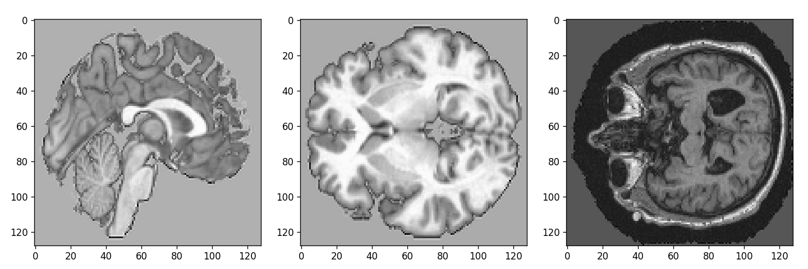
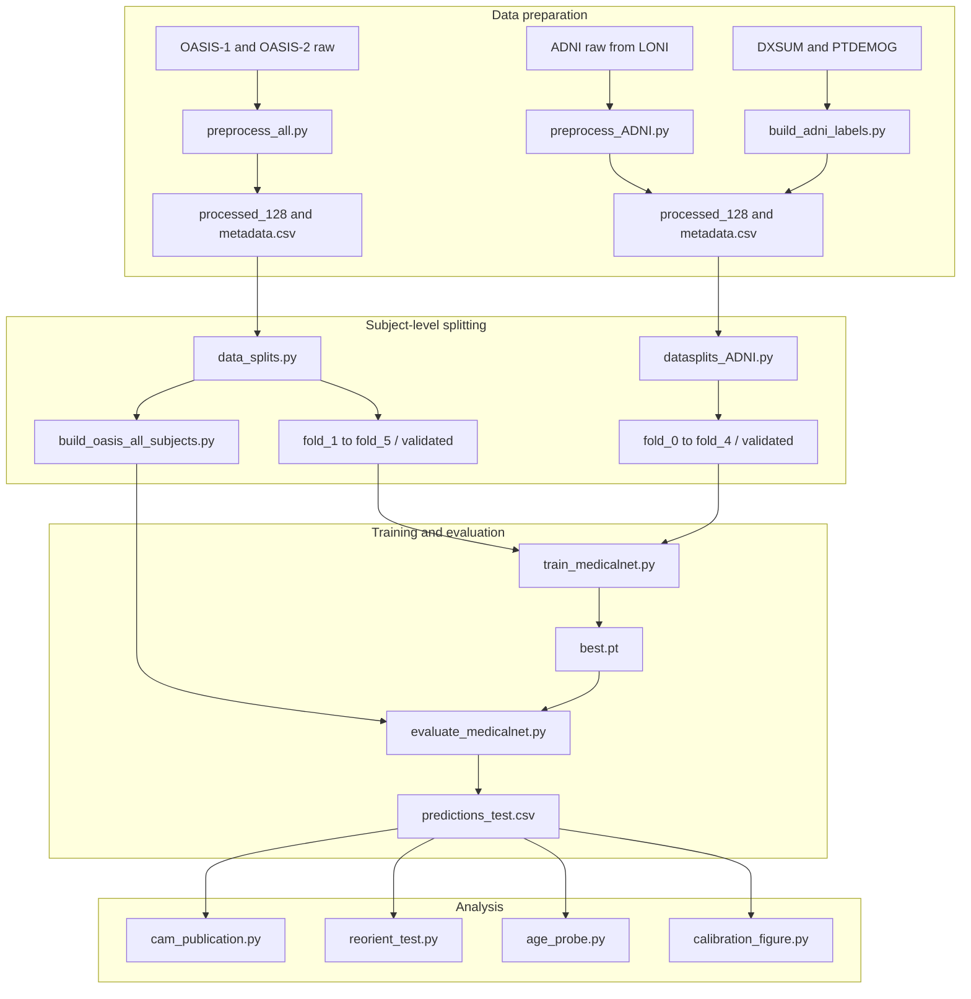

<div align="center">

# Robustness of 3D CNN Alzheimer's Disease Classification to Age Distribution Shift

**A leakage-controlled decomposition of cross-cohort failure in structural MRI classification**

MSc Computational Cognitive Neuroscience · Goldsmiths, University of London · September 2026

[](https://www.python.org/)
[](https://pytorch.org/)
[](#data-availability)
[](LICENSE)

</div>

---

## Overview

Deep learning classifiers report strong accuracy for Alzheimer's disease detection from structural MRI, yet fewer than one in six validate externally. Because age is both the strongest risk factor for the disease and a powerful independent driver of brain morphology, a classifier can achieve high pooled accuracy by learning age-correlated anatomy as a proxy for pathology.

This repository contains the complete pipeline for a study that asks what actually breaks when such a model is moved to a new cohort. A deterministic subject-level pipeline was built on the OASIS cohorts with ADNI as an external validation cohort, applying identical five-fold protocols across a three-class CN/MCI/AD arm and a two-class CN-versus-AD arm. Every reported performance estimate is a held-out test score with a bootstrap interval, across 24 cells and three backbones in both transfer directions.

The result is not a better classifier. It is a decomposition: apparent distribution-shift failure separates into a decision rule that no longer matches the target prevalence, a representation that partly encodes age rather than pathology, and an image-space convention unrelated to either population. Two of the three admit label-free corrections.

 **[Methods summary](#methods-summary)** ·  **[Reproduction steps](#reproducing-the-results)**

---

## Key results

**Within-cohort performance is modest, and much of it is indistinguishable from chance.**
The strongest configuration reached ROC-AUC 0.765 (95% CI 0.689 to 0.830) on CN versus AD in ADNI. Ten of twenty-four cells have a bootstrap interval containing 0.500.

**Under transfer, ranking and categorical performance dissociate.**
Across the three-class arm, macro-F1 degraded between 1.2 and 38 times faster than ROC-AUC. In the clearest instance, one fold assigned the control label to all 263 target subjects, giving balanced accuracy of exactly 0.500 and accuracy of 0.837 from base rate alone, while retaining ROC-AUC 0.760 against its own within-cohort 0.766. The representation transferred; the threshold did not.

**Prediction collapse is the failure mode, and it precedes cohort shift.**
Across 72 cell-and-intervention combinations, 23 contain folds that assign one class to every subject. Five occur at baseline, two of them within cohort.

**A label-free threshold correction recovers most of the loss.**
Prevalence-matched assignment, which uses only the target population's class proportions and no individual labels, recovered macro-F1 from 0.378 to 0.600 in the strongest cross-cohort cell and improved 23 of 24 cells. Naive prior correction did the opposite, destroying the classifier outright in six cells.

**The level at which an age intervention acts determines whether it works.**
A controlled four-condition ablation on matched folds shows chronological age becoming less decodable from the learned representation under age-bin undersampling, in all five folds and at no cost to disease discrimination. Loss reweighting, which targets the same quantity through per-sample weights, did not reproduce the reduction.

**A preprocessing audit found three mutually unaligned voxel axis orders across the sources.**
Correcting this at evaluation, from image header metadata alone, raised cross-cohort ROC-AUC from 0.672 to 0.773, above the same model's within-cohort figure.

---

## The preprocessing audit

Three source image domains reach the network, and no two share an axis order. OASIS-1 stores L, A, S; OASIS-2 stores A, S, L; ADNI stores I, P, L. No stage in the original pipeline reoriented volumes to a canonical order, so each array arrived in the order stored in its own file.

<div align="center">

</div>

<sub>**Figure 1.** Representative mid-slices from the three source image domains before canonical reorientation. Because the source arrays use different axis orders, the displayed mid-slice corresponds to a different anatomical plane in each panel. Skull and scalp retention also differs by source: OASIS-1 arrives Talairach-88 registered and skull-stripped, OASIS-2 and ADNI arrive in native space with the skull intact.</sub>

Two consequences follow. The single-axis flip used in augmentation was anterior-posterior for OASIS-1 and ADNI and superior-inferior for OASIS-2, so the intended left-right mirror was anatomically invalid in all three sources. And the depth axis, which the R3D-18 stem never downsamples, corresponds to a different anatomical direction in each cohort.

`reorient_test.py` implements the correction. It is a pure array permutation and flip derived from the NIfTI affine, so it adds no information and uses no labels.

---

## Repository layout

Eighteen files, grouped by role. Every file listed here is on the path from raw scans to a reported number.

### Data preparation

| File | Role |
|:--|:--|
| `preprocess_all.py` | OASIS ingestion and preprocessing. Percentile masking, fill-holes, erosion and dilation, within-mask clipping and z-scoring, bounding-box crop, cubic resampling to 128³. Writes `processed_{res}/` and `metadata.csv`. |
| `preprocess_ADNI.py` | ADNI equivalent, matched step for step to the OASIS pipeline. |
| `build_adni_labels.py` | Builds ADNI labels from the DXSUM and PTDEMOG tables at the selected visit, collapsing EMCI and LMCI to MCI. |
| `data_splits.py` | OASIS splitting. One scan per subject before any partitioning, then stratified five-fold over a composite age-bin by label key, with optional within-age-bin balancing applied to the training partition only. |
| `datasplits_ADNI.py` | ADNI splitting. Reserves a 20% global holdout before fold construction. |
| `build_oasis_all_subjects.py` | Assembles the all-subject OASIS target CSV that makes ADNI to OASIS transfer possible. |

### Models

| File | Role |
|:--|:--|
| `resnet3d_OASIS.py` | Torchvision R3D-18 builder and the shared three-channel to one-channel first-convolution adaptation. Imported by every other model and analysis module despite the cohort-suffixed name. |
| `medicalnet3d.py` | MedicalNet ResNet-18, pretrained on 23 medical 3D datasets. Uses the released segmentation backbone variant, so spatial resolution holds at one eighth of the input rather than downsampling to one thirty-second. |
| `mobilenet3d_v2.py` | MobileNet3D-V2, Kinetics-600 pretrained. |

### Training and evaluation

| File | Role |
|:--|:--|
| `dataset.py` | Volume loader. Applies the `permute(2, 0, 1)` axis transposition that reorders the loaded array to depth-height-width. This step is load-bearing: any analysis run against a loader without it will feed the model volumes in a different axis order than training used and return plausible but meaningless numbers. |
| `train_medicalnet.py` | The trainer for all three backbones, and cohort-agnostic. Cohort is selected purely through `--splits_dir`, because the split CSVs carry absolute scan paths. |
| `evaluate_medicalnet.py` | The evaluator, covering all three backbones. Rebuilds the exact architecture from the fields present in the checkpoint's stored config, reads the training crop size back from the checkpoint, guards row alignment between predictions and the test CSV, and writes the per-subject `predictions_test.csv` file that every result in the study is computed from. |

### Interventions

| File | Role |
|:--|:--|
| `groupdro.py` | Group distributionally robust optimisation over groups of age bin crossed with diagnostic label. Tracks per-group losses as an exponential moving average, because the memory budget permits a batch of two and the method assumes batches large enough to hold several samples per group. |
| `age_adversary.py` | Gradient reversal layer and age-prediction head, training the backbone to make age unpredictable while the classification head trains normally. |

### Analysis

| File | Role |
|:--|:--|
| `age_probe.py` | Age decodability from the penultimate feature vector. Hooks the input to `fc`, fits RidgeCV on each fold's training subjects and evaluates on its held-out test subjects with the same fold model. Never pools embeddings across folds, because five separately trained models have five different feature spaces. |
| `reorient_test.py` | Evaluation-time axis-order correction derived from the NIfTI affine. No retraining, no labels. |
| `calibration_figure.py` | Binned expected calibration error and per-age-bin temperature scaling. |
| `cam_publication.py` | Volumetric attribution. Implements HiResCAM, Grad-CAM and Grad-CAM++ with the Adebayo randomisation sanity check. |

---

## Pipeline



---

## Installation

```bash
git clone https://github.com/DrKaloo/MRI-Classification.git
cd MRI-Classification

python -m venv .venv
source .venv/bin/activate          # Windows: .venv\Scripts\activate

pip install -r requirements.txt
```

The torch and torchvision versions in `requirements.txt` are lower bounds. Install the build matching your CUDA version from the [PyTorch selector](https://pytorch.org/get-started/locally/) rather than from PyPI defaults, particularly on recent hardware where the default wheel may not carry the required compute capability.

Pretrained backbone weights are not vendored. R3D-18 downloads its Kinetics-400 weights through torchvision automatically. MedicalNet and MobileNet3D-V2 weights must be obtained from their original releases and passed explicitly:

```bash
--medicalnet_weights   pretrained/resnet_18_23dataset.pth
--mobilenet3d_weights  pretrained/kinetics_mobilenetv2_1.0x_RGB_16_best.pth
```

---

## Reproducing the results

### 1. Preprocess

```bash
python preprocess_all.py --no_wipe --no_force
python preprocess_ADNI.py --resolution 128
```

`preprocess_all.py` wipes the `processed_{res}` output folders before running unless `--no_wipe` is passed. Running it with no arguments, including by pressing Run in an IDE, deletes every processed volume and then regenerates from scratch. Always pass `--no_wipe --no_force` for a resume-safe run. The behaviour is controlled by `DEFAULT_WIPE` at the top of the file.

### 2. Build labels and splits

```bash
python build_adni_labels.py

python data_splits.py \
    --metadata data/metadata.csv \
    --resolution 128 \
    --n_folds 5 \
    --age_bins 70 80 \
    --balance_age_bins \
    --seed 1337

python datasplits_ADNI.py --n_folds 5 --seed 1337
python build_oasis_all_subjects.py
```

Fold assignment is deterministic given the subject set and the seed. `data_splits.py` selects one scan per subject before any splitting, and balancing is applied to the training partition only. Validation and test partitions are never balanced.

### 3. Train

```bash
python train_medicalnet.py \
    --backbone r3d_18 --pretrained \
    --splits_dir data/splits/res_128/5fold/fold_1/validated \
    --results_dir results/oasis_r3d_fold_1 \
    --epochs 60 --batch_size 2 --accum_steps 4 \
    --patch_size 96 --lr 1e-4 --freeze_epochs 10 \
    --early_patience 12 --monitor macro_f1 --seed 1337
```

Backbone choices are `r3d_18`, `r2plus1d_18`, `custom_small`, `medicalnet_resnet18` and `mobilenet3d_v2`. Class count is inferred from the split CSVs, so switching between the three-class and two-class arms requires no change to the trainer or the models.

### 4. Evaluate

```bash
# Within cohort
python evaluate_medicalnet.py \
    --ckpt results/oasis_r3d_fold_1/best.pt \
    --splits_dir data/splits/res_128/5fold/fold_1/validated \
    --results_dir results/oasis_r3d_fold_1/eval_within

# Cross cohort: the same checkpoint against the complete opposite cohort
python evaluate_medicalnet.py \
    --ckpt results/oasis_r3d_fold_1/best.pt \
    --splits_dir data/splits_adni/all/validated \
    --results_dir results/oasis_r3d_fold_1/eval_cross
```

The same two commands cover MedicalNet and MobileNet3D-V2 checkpoints unchanged. No backbone flag is needed at evaluation time.

`--ckpt` and `--splits_dir` are both required. `--splits_dir` selects which cohort the model is scored against, so making it explicit is what keeps a within-cohort run and a cross-cohort run from being confused for one another after the fact. Each evaluation prints the architecture it rebuilt, the split directory the checkpoint was trained on, and the split directory it is being evaluated against, and records all three in `evaluation_summary.json`.

`--patch_size` defaults to whatever the checkpoint recorded at training time and does not need to be passed. Training and evaluation crop sizes must match, or the model sees a different field of view at test time than it was trained on. Setting the flag explicitly overrides the checkpoint and prints a warning if the two disagree.

The training script writes no prediction file. Only `evaluate_medicalnet.py` does, and every number in the study derives from those per-subject files. A best-epoch validation score printed during training is not a performance estimate; see [Reproducibility notes](#reproducibility-notes).

### 5. Analyse

```bash
python calibration_figure.py --index results/index.csv --outdir analysis_out
python age_probe.py --index results/index.csv --out analysis_out/age_probe.csv
python reorient_test.py --ckpts "results/adni_r3d_fold_*/best.pt" \
                        --splits_dir data/splits/res_128/all/validated \
                        --target_axcodes IPL --out analysis_out/reorient.csv
python cam_publication.py --ckpts "results/adni_r3d_fold_*/best.pt" \
                          --splits_dir data/splits/res_128/all/validated \
                          --method hirescam --sanity --outdir analysis_out/cam
```

---

## Results

### Cohort composition after subject selection

| Cohort | Subjects | CN | MCI | AD | Under 70 | 70 to 80 | 80 and over |
|:--|--:|--:|--:|--:|--:|--:|--:|
| OASIS | 385 | 220 | 122 | 43 | 111 | 154 | 120 |
| ADNI | 458 | 134 | 227 | 97 | 79 | 269 | 110 |

One scan per subject was retained before splitting. The two-class arm contains 263 OASIS subjects (220 CN, 43 AD) and 231 ADNI subjects (134 CN, 97 AD). The under-70 diagnostic distributions differ markedly between cohorts: 76% CN and 5% AD in OASIS, against 6% CN and 32% AD in ADNI.

### Two-class arm, within and cross-cohort

Held-out test scores, five-fold mean ± standard deviation. Cross-cohort evaluation applies each trained fold to the complete opposite cohort.

| Backbone | Training cohort | Within macro-F1 | Within ROC-AUC | Cross macro-F1 | Cross ROC-AUC |
|:--|:--|--:|--:|--:|--:|
| **R3D-18** | ADNI | **0.680 ± 0.136** | **0.766 ± 0.102** | 0.378 ± 0.226 | 0.672 ± 0.074 |
| MedicalNet | ADNI | 0.513 ± 0.111 | 0.579 ± 0.080 | 0.374 ± 0.050 | 0.564 ± 0.098 |
| MobileNet3D-V2 | ADNI | 0.553 ± 0.106 | 0.639 ± 0.106 | 0.355 ± 0.082 | 0.557 ± 0.076 |
| R3D-18 | OASIS | 0.563 ± 0.102 | 0.626 ± 0.174 | 0.473 ± 0.028 | 0.470 ± 0.036 |
| MedicalNet | OASIS | 0.569 ± 0.112 | 0.663 ± 0.116 | 0.394 ± 0.038 | 0.502 ± 0.005 |
| MobileNet3D-V2 | OASIS | 0.432 ± 0.036 | 0.491 ± 0.092 | 0.447 ± 0.073 | 0.518 ± 0.013 |

Only a minority of the 48 paired backbone comparisons exclude zero. What is defensible is narrow: in the ADNI two-class within-cohort run, R3D-18 exceeds both other backbones on macro-F1 and ROC-AUC with all four intervals excluding zero. No backbone difference is defensible in the three-class arm.

### Threshold interventions, R3D-18, two-class arm

| Cell | Baseline macro-F1 | Naive prior correction | Prevalence matched | Oracle balanced accuracy |
|:--|--:|--:|--:|--:|
| ADNI within cohort | 0.680 | 0.664 | **0.697** | 0.760 |
| OASIS within cohort | 0.563 | 0.455 | **0.623** | 0.673 |
| ADNI to OASIS | 0.378 | 0.455 | **0.600** | 0.679 |
| OASIS to ADNI | 0.473 | 0.395 | **0.485** | 0.519 |

Prevalence matching uses the estimated target class proportions and no individual target labels. The oracle threshold uses test labels and is reported only as a diagnostic upper bound, never as an available method. In the ADNI to OASIS cell the oracle reaches balanced accuracy 0.679 against 0.688 within cohort, so threshold placement accounts for almost the whole of the observed loss.

### Age decodability under training intervention

Four matched conditions on the same cohort, arm, architecture and folds, differing only in how the age-diagnosis association in the training data is handled.

| Condition | Age R² | Age MAE (years) | Disease ROC-AUC | Folds with reduced age R² |
|:--|--:|--:|--:|:--|
| Untreated control | 0.470 | 1.97 | 0.646 | – |
| Age-conditional loss reweighting | 0.500 | 2.19 | 0.638 | 2 of 5 |
| Adversarial age-invariance | 0.520 | 2.22 | 0.582 | 1 fold only |
| **Age-bin undersampling** | **0.288** | **1.35** | 0.651 | **5 of 5** |

Only the intervention that changes what the network sees reduced the age representation, and it did so at no cost to disease discrimination. The raw difference overstates the effect: the probe is itself trained on the surviving subjects, and capping both probes at a common size reduces the gap to roughly 0.05 to 0.08. Undersampling also cuts the training set from 277 subjects to roughly 90, so data removal is confounded with association removal. What survives is the direction, the consistency across all five folds, and the absence of any cost to discrimination. The magnitude does not.

The adversarial condition completed one fold only and is reported descriptively.

### Evaluation-time axis-order correction, R3D-18, ADNI to OASIS

| Measure | Before correction | After correction | Change |
|:--|--:|--:|--:|
| Cross-cohort ROC-AUC | 0.672 | **0.773** | +0.101 |
| Balanced accuracy | 0.540 | 0.676 | +0.136 |
| Degenerate folds | 2 of 5 | 0 of 5 | −2 folds |
| OASIS-1 ROC-AUC | 0.775 | 0.828 | +0.053 |
| OASIS-2 ROC-AUC | 0.641 | 0.766 | +0.125 |
| OASIS-1 versus OASIS-2 gap | 0.134 | 0.072 | −0.062 |

Reorientation is derived solely from NIfTI header information and requires no retraining and no target labels. The corrected cross-cohort ROC-AUC of 0.773 exceeds the same model's within-cohort 0.765.

The benefit is confined to R3D-18, which was also the only backbone with clearly above-chance baseline cross-cohort ranking. MobileNet3D-V2 and MedicalNet lose 0.017 and 0.012. The reading consistent with both observations is that the correction restores signal that was already present rather than creating it, so the claim is kept narrow.

---

## Methods summary

<details>
<summary><b>Training hyperparameters</b> (held constant across both arms and all three backbones except where stated)</summary>

<br>

| Setting | Value | Note |
|:--|:--|:--|
| Input volume | 128³ isotropic | from cropped brain bounding box |
| Train / evaluation crop | 96³ random / centre | 75% linear field of view |
| Batch size | 2, accumulation 4 | effective batch 8; mixed precision; gradient clip 1.0 |
| Optimiser | AdamW, weight decay 1 × 10⁻⁴ | cosine annealing to 5% of initial rate |
| Learning rate | 3 × 10⁻⁴ ADNI, 1 × 10⁻⁴ OASIS | confounded with cohort; one fold exception |
| Freeze schedule | 10 epochs head-only | then unfrozen at half the learning rate |
| Loss | focal cross-entropy | gamma 1.5, label smoothing 0.05, inverse-frequency weights |
| Dropout | 0.2 | identical in both arms |
| Epochs and selection | 60 maximum, patience 12 | validation macro-F1, raw weights, no EMA |
| Seed | 1337 | fold assignment deterministic given subject set |

</details>

<details>
<summary><b>Evaluation and uncertainty protocol</b></summary>

<br>

Macro-F1 is the primary metric. Balanced accuracy is reported alongside and is informative under prior shift, because it is invariant to the class distribution of the evaluation set whereas macro-F1 is not. This matters when comparing OASIS at 84% CN in the two-class arm with ADNI at 58%. Macro-F1 has no universal chance value, so every comparison against chance is made on balanced accuracy or ROC-AUC. Calibration is binned expected calibration error.

Uncertainty is a per-subject bootstrap with 2,000 resamples, and the protocol differs by regime. Within cohort the five test folds partition the cohort, so predictions are pooled and subjects resampled with replacement. Across cohorts all folds see the same targets, so pooling would count each subject five times; instead one subject resample is drawn, each fold's metric is recomputed on it, and the five are averaged. Intervals therefore cover subject sampling only, so the across-fold standard deviation is reported alongside.

Comparisons are paired. Because all backbones see the same folds and subjects, the correct test is a bootstrap on the difference using identical resamples, and the same applies to baseline against intervention. The age-gap family is corrected by Holm-Bonferroni, with both uncorrected and corrected outcomes reported.

Cells in which any fold assigned a single class to every subject are excluded from gap analysis and flagged in calibration analysis, because a constant predictor has per-bin performance determined entirely by each bin's class composition.

</details>

<details>
<summary><b>Why harmonisation is deliberately not applied</b></summary>

<br>

The dominant response to cross-cohort variation is harmonisation, in which site effects are estimated and removed before modelling. It is not applied here for a methodological reason: removing an estimated site effect would also remove part of the signal this study is trying to attribute, making it impossible to say how much residual degradation is population, decision rule or image convention. The decomposition is the point, and harmonisation would collapse it.

</details>

---

## Data availability

No participants were recruited and no identifiable data were handled. Neither cohort is redistributed in this repository, and neither may be redistributed by users of it.

**OASIS** (Open Access Series of Imaging Studies), cross-sectional and longitudinal collections, is available from [oasis-brains.org](https://www.oasis-brains.org/) under its own data use terms. Labels derive from the Clinical Dementia Rating: 0 to CN, 0.5 to MCI, 1 or above to AD.

**ADNI** (Alzheimer's Disease Neuroimaging Initiative) requires an approved application through the [LONI Image and Data Archive](https://ida.loni.usc.edu/). Scans were obtained as ADNI's own processed volumes, so vendor corrections had already been applied and were not uniform: N3 correction on all 458 scans, GradWarp on 419, B1 correction on 354. The OASIS scans received none of these. This asymmetry is a real confound in the cross-cohort comparison and is reported as such.

Expected directory layout once both cohorts are in place:

```
data/
├── raw/                            # OASIS-1 and OASIS-2 source scans
├── processed_128/                  # preprocessing output, 128³ NIfTI
├── metadata.csv
├── oasis_longitudinal_demographics.csv
├── splits/res_128/
│   ├── 5fold/fold_{1..5}/validated/
│   └── all/validated/              # cross-cohort target
└── splits_adni/
    ├── fold_{0..4}/validated/
    ├── holdout/validated/
    └── all/validated/              # cross-cohort target
```

---

## Reproducibility notes

The study audited its own pipeline and reports what the audit found. These are the caveats a reader should carry.

**Split files are not portable.** The absolute scan path is written into every split CSV, so a split set generated on one machine will not resolve on another without rewriting. Regenerating splits with the same seed and the same subject set reproduces identical fold membership, because subject selection sorts deterministically before the fold constructor runs.

**Fold numbering is inconsistent between cohorts.** OASIS uses `fold_1` to `fold_5`; ADNI uses `fold_0` to `fold_4`. Any loop over folds must account for this.

**A validation maximum is not a performance estimate.** An audit established that within-cohort figures previously held for this project were best-epoch validation scores printed by the training script rather than held-out test scores. Across the four cells where both figures exist, macro-F1 fell from 0.516 to 0.409, 0.530 to 0.399, 0.531 to 0.391 and 0.459 to 0.349, an inflation of 0.107 to 0.140. The dominant mechanism is a winner's curse rather than a coding defect: the trainer retains the maximum validation macro-F1 over up to sixty epochs, and taking the maximum of many noisy estimates is upward biased by roughly the noise scale. Per-epoch validation macro-F1 swings between about 0.14 and 0.57 on folds of thirty subjects. The effect was reproduced prospectively on a fresh run, in which a condition selected its checkpoint at a validation macro-F1 of 1.000, computed on eight subjects, and scored 0.445 on the held-out set at a ROC-AUC of 0.433.

**Preprocessing limits absolute cross-cohort interpretation.** OASIS contains two image domains, OASIS-2 volumes were not effectively cropped because the intensity mask covered the entire field of view, axis order was not canonicalised at training time, the augmentation flip was anatomically invalid in all three sources, and the evaluation centre crop discards roughly 58% of the volume. These defects prevent the uncorrected transfer gap from being attributed to population difference alone. They do not invalidate the within-to-cross comparisons themselves, because the same trained model is evaluated in both regimes, but they constrain what can be inferred about why the gap occurs.

**Power is limited.** OASIS contains only 43 AD subjects, eight or nine per test fold. Ten of twenty-four cells are indistinguishable from chance. Fold variance is not seed variance, and repeated-seed analysis was not completed.

**The age-shift simulation failed as constructed and is reported as such.** The training pool exhausted, so two of four conditions drew the same subjects and returned identical predictions, and the manipulation varied sample size considerably more than it varied age. Because it was the only design intended to isolate age shift from other cohort differences, this study cannot claim that changing age distribution alone caused the observed degradation.

**The two intervention modules are provided as implementations, not as trainer flags.** `groupdro.py` and `age_adversary.py` contain the group distributionally robust optimisation and gradient-reversal components used for the results in the corresponding sections of the thesis. The training variant that wires them into the optimisation loop is not included in this repository, so `train_medicalnet.py` as shipped reproduces the baseline and the age-bin balancing arm but not those two conditions. The modules are self-contained and depend only on PyTorch, so they can be attached to the trainer directly.

**Loader verification.** Re-evaluating one stored checkpoint from raw volumes reproduced its stored macro-F1 (0.5889), balanced accuracy (0.6106), ROC-AUC (0.6727) and accuracy (0.6757) to four decimal places.

---

## Citation

```bibtex
@mastersthesis{todorov2026robustness,
  author  = {Todorov, Kaloyan},
  title   = {Robustness of {3D} {CNN} {Alzheimer's} Disease Classification
             to Age Distribution Shift},
  school  = {Goldsmiths, University of London},
  address = {London, United Kingdom},
  year    = {2026},
  type    = {{MSc} thesis},
  note    = {MSc Computational Cognitive Neuroscience},
  url     = {https://github.com/DrKaloo/MRICode}
}
```

---

## Acknowledgements

Supervised by Dr Basel Barakat, School of Computing, Goldsmiths, University of London. Additional guidance on neural network architecture from Dr Nikolay Nikolaev.

Data used in preparation of this work were obtained from the Alzheimer's Disease Neuroimaging Initiative (ADNI) database (adni.loni.usc.edu). The investigators within ADNI contributed to the design and implementation of ADNI and provided data but did not participate in analysis or writing of this report. ADNI is funded by the National Institute on Aging and the National Institute of Biomedical Imaging and Bioengineering, and through generous contributions from its listed private-sector partners.

Data were also provided in part by OASIS, the Open Access Series of Imaging Studies, comprising the OASIS-1 cross-sectional and OASIS-2 longitudinal collections (Marcus et al., 2007, 2010).

Pretrained weights: R3D-18 from torchvision (Tran et al., 2018, Kinetics-400); MedicalNet ResNet-18 from Chen et al. (2019); MobileNet3D-V2 from Köpüklü et al. (2019, Kinetics-600).

---

## Licence

Code is released under the [MIT Licence](LICENSE). The OASIS and ADNI datasets are governed by their own data use agreements and are not covered by it.

